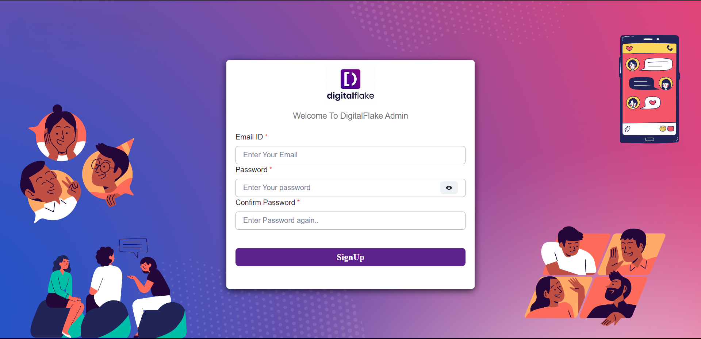

DigitalFlakes_Frontend Task Using ReactJS

## Getting Started

Step1: npm install
Step2: npm start

## Screenshots

Below are screenshots showcasing the user interface of the frontend, which has been developed using React.

### Login Page

### Login Page Validation

### Login Success

### SignUp Page

### Existing User Check

### Existing User Check

### Password Length Validation

### Successful Signup And Redirection To Login 

### Token Generation Using JWT and Password Hashing Using bcyrpt

